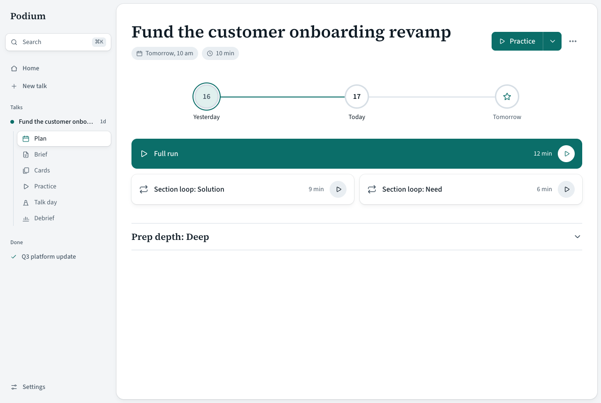
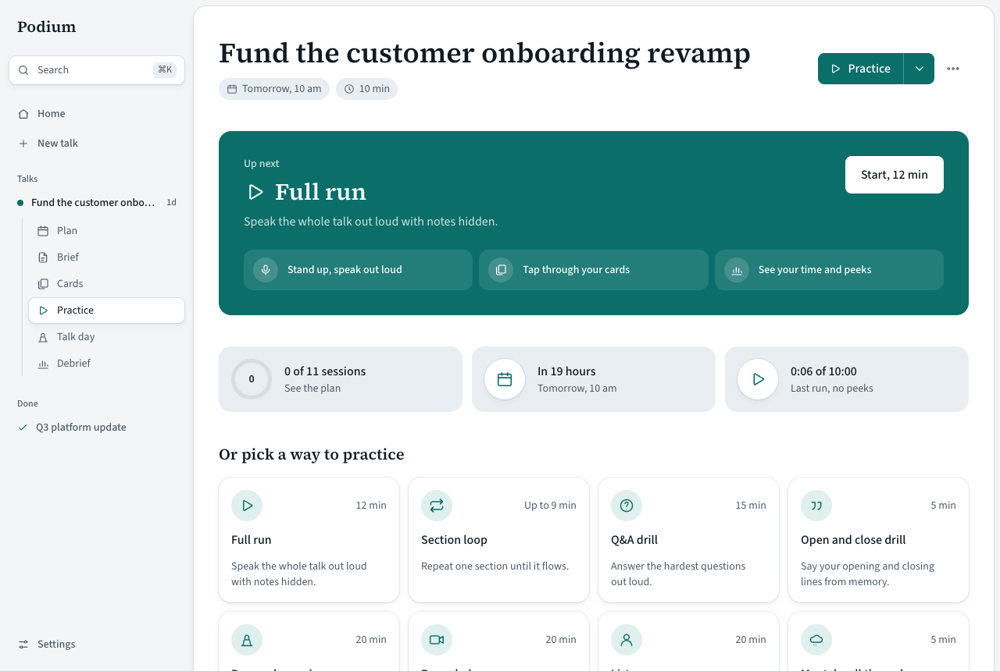
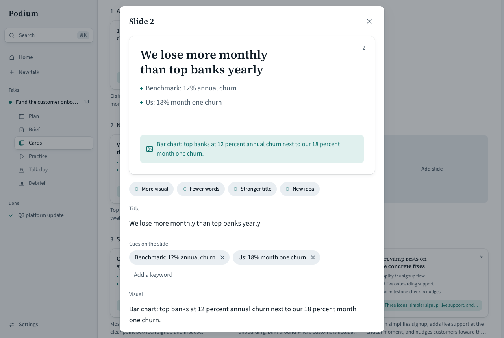
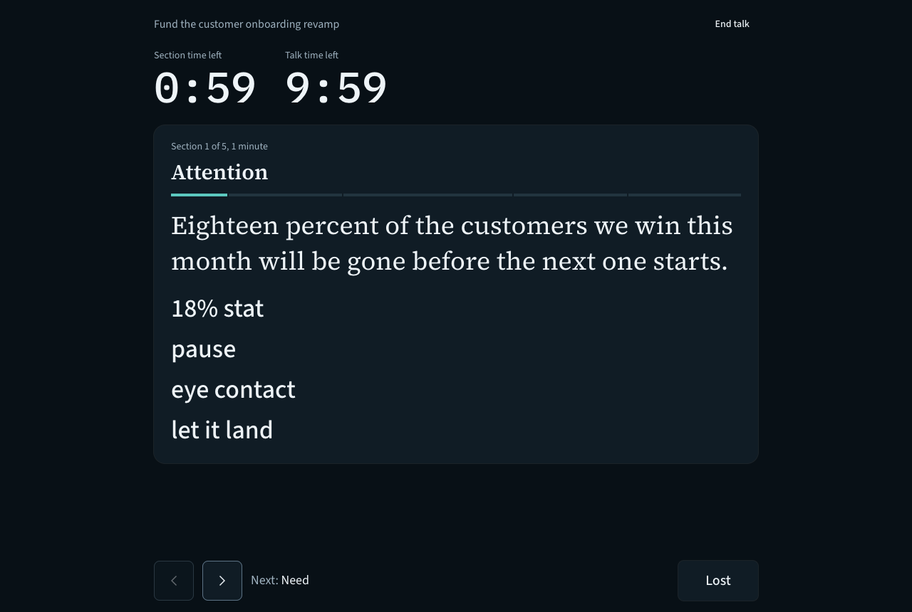

# Podium

I built Podium to get ready for talks without filling in forms. Tell it about your talk, and it plans your practice all the way to the stage.



## What it does

- Turns a voice note, a sentence, a slide deck, or a few links into a brief, cue cards, and a practice plan.
- Drafts slides section by section if you have none. If you have a deck, it links your cue cards to it.
- Runs timed practice out loud, counts how often you peek, and quizzes you with the hard questions.
- Gives you a talk-day routine and full-screen cue cards on stage.
- Takes a one-minute debrief that shapes your next talk.

| Practice | Slides | Live |
| --- | --- | --- |
|  |  |  |

## Run it

You need [Bun](https://bun.sh) and Node 20 or newer.

```bash
git clone https://github.com/nmbrthirteen/podium.git
cd podium
bun install
bun dev
```

Open http://localhost:3000. Your data stays in `./data`.

The coach uses the [Claude Code](https://claude.com/claude-code) or [Codex](https://github.com/openai/codex) CLI you're already signed in to. If you use neither, set `OPENROUTER_API_KEY`. You can pick a provider in Settings.

## Host it

Set `PODIUM_MODE=hosted` and fill in [`.env.example`](.env.example). Hosted mode adds accounts and uses OpenRouter only.

Use a server with a persistent disk and point `PODIUM_DATA_DIR` at it. Uploaded decks and recordings are stored on that disk. `TURSO_DATABASE_URL` moves the database to Turso.

## Develop

```bash
bun run check      # lint, types, build
bun run test       # unit tests
bun run test:e2e   # browser tests, needs Chrome
```

## License

[AGPL-3.0](LICENSE). If you run a modified Podium for other people, share your changes.
